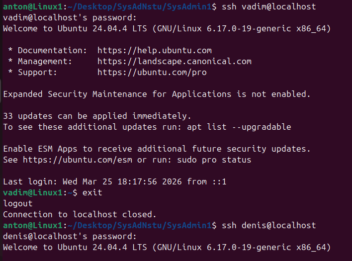
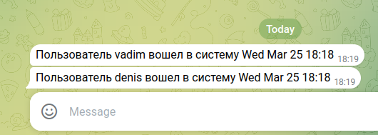

# Лабораторная работа №1: система отслеживания новых подключений пользователей к ОС Linux с автоматической отправкой уведомлений в Telegram через cron каждую минуту.
## Пример работы:
**Симуляция новых подключений**

**Пример ответа Telegram‑бота**

 

